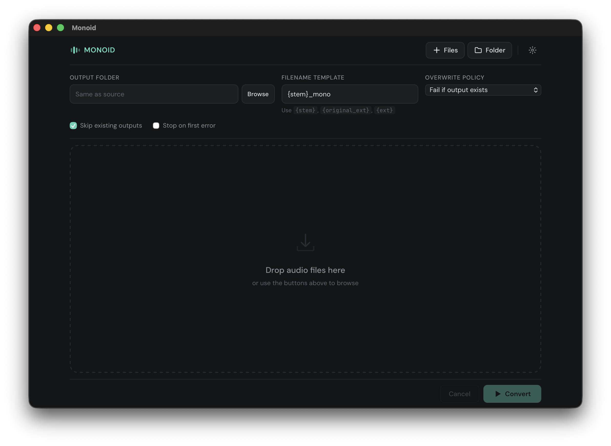
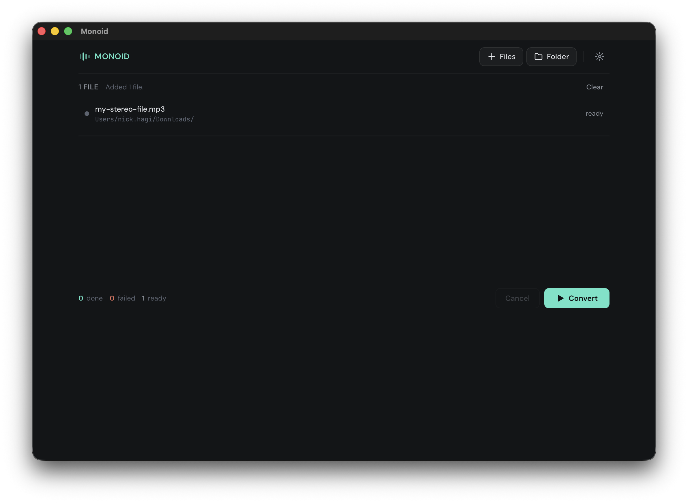
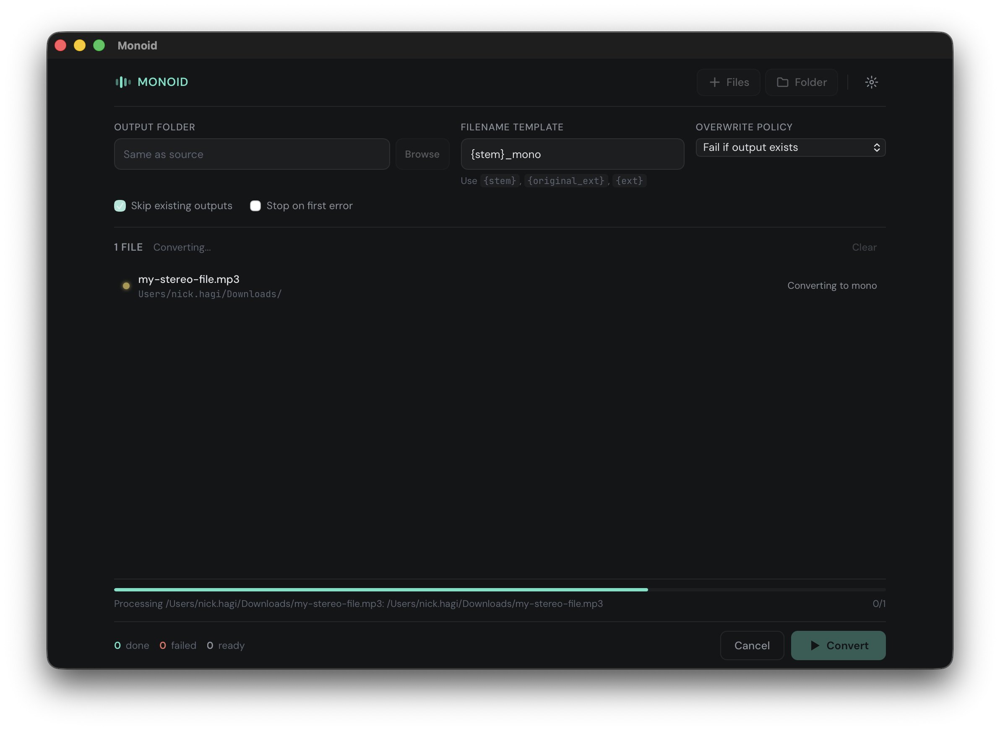
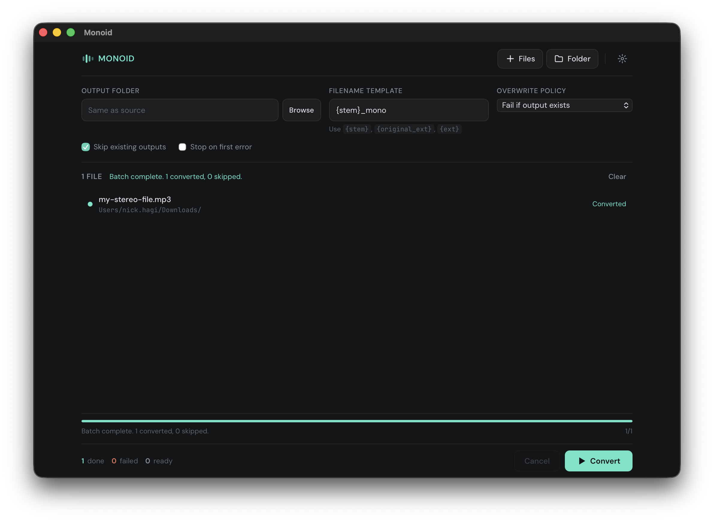

<div align="center">


# Monoid

**Batch stereo-to-mono audio converter**

[](https://github.com/srgrn/monoid/releases/latest)
[](https://github.com/srgrn/monoid/actions)
[](#)
[](https://v2.tauri.app)
[](LICENSE)

Drop audio files in, get mono WAV files out.

<br />



</div>

<br />

## Screenshots

| Queue ready | Converting | Complete |
|:-----------:|:----------:|:--------:|
|  |  |  |

## Features

- Drag-and-drop files or scan a folder recursively
- Batch queue with per-file status tracking
- Configurable output folder, filename template, and overwrite policy
- Skip existing outputs or stop on first error
- Real-time progress with batch completion summary
- Cross-platform: macOS (signed & notarized), Linux, Windows

## Supported Formats

**Input:** `wav` `mp3` `flac` `aac` `ogg` `m4a` `mp4` `aiff` `caf` `mkv`
&nbsp;&middot;&nbsp; **Output:** mono 16-bit WAV

Audio decoding is powered by [Symphonia](https://github.com/pdeljanov/Symphonia).

## How Conversion Works

For each decoded frame, Monoid averages all channels into a mono sample, normalizes safely, and writes a WAV output. Designed for straightforward mono conversion rather than mastering-grade mix decisions.

By default, outputs use the pattern `{stem}_mono.wav`, configurable via the filename template field.

## Development

```bash
npm ci                                        # install dependencies
npm test                                      # run frontend tests
cargo test --manifest-path src-tauri/Cargo.toml  # run Rust tests
npm exec tauri dev                            # run in development
npm exec tauri build                          # build for current platform
```

Cross-build the Windows installer from Linux:

```bash
npm exec tauri build -- --target x86_64-pc-windows-gnu
```

## Release Automation

GitHub Actions is configured to:

- Run JavaScript and Rust tests on every pull request
- Create a tagged release from the current version when triggered manually
- Build release bundles for Linux, Windows, and macOS
- Sign and notarize the macOS build via Apple's notarization service
- Publish a GitHub release with all artifacts attached

### macOS Code Signing & Notarization

The macOS build is automatically signed and notarized using `tauri-apps/tauri-action`. The following GitHub Secrets must be configured:

| Secret | Description |
|--------|-------------|
| `APPLE_CERTIFICATE` | Base64-encoded `.p12` Developer ID Application certificate |
| `APPLE_CERTIFICATE_PASSWORD` | Password for the `.p12` certificate |
| `APPLE_SIGNING_IDENTITY` | e.g. `"Developer ID Application: Name (TEAMID)"` |
| `APPLE_API_ISSUER` | App Store Connect API issuer ID |
| `APPLE_API_KEY` | App Store Connect API key ID |
| `APPLE_API_KEY_PATH` | Base64-encoded `.p8` private key from App Store Connect |

To base64-encode a file for use as a secret:

```bash
base64 -i <file> | pbcopy
```
